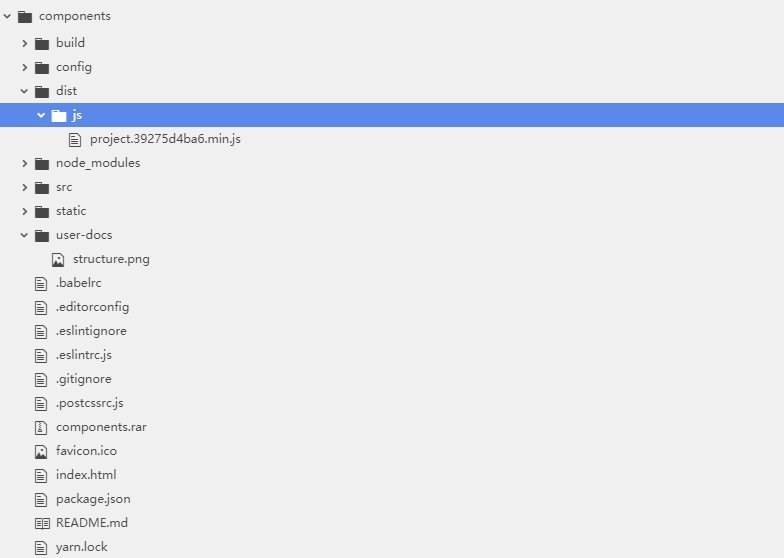

# Custom Components

> 自定义组件

## 准备

* node下载并安装。下载地址：http://nodejs.cn/download/

## Warnings

* package.json 中依赖版本请不要升级，保持与 logwire pc端的版本一致，否则打出来的包在logwire将无法使用

* logwire pc端 `Vue` 版本为 `2.1.4` , `vuex` 版本为 `2.0.0` , `vue-router` 版本为 `2.5.3`


## Build Setup Command

``` bash
# install dependencies
npm install

# serve at localhost:8090
npm run dev

# build for production with minification
npm run dist
```

## 主要目录结构说明

* 结构图



* dist: `npm run dist` 最终生成的包存储位置

* src

   * components: 自定义组件目录
   * App.vue：测试环境程序根节点
   * index.js: `npm run dist` 生产程序入口，所有的自定义组件都在该文件中注册
```js
const install = function (Vue) {
  Vue.component(cusDiv.name, cusDiv)
  ...
}
```
   * main.js： `npm run dev` 开发环境程序入口，作为自定义组件的测试入口

## 开发环境测试

* 将自定义组件放入App.vue父组件中，然后运行 `npm run dev` ，在浏览器中输入 http://localhost:8091

## 在logwire中使用

* logwire平台暴露了 `EventBus` 事件总线，直接属于 `window` 的一个属性

* `npm run dist` 构建的 `js` 包名称，必须以 `project` 作为前缀，即 `output` 属性值请不要修改

* 将 `dist/js` 下构建包放到 `assets/js` 目录下，然后就可以在 `layout` 文件中正常使用该组件，例如 `<lw-cus-div/>`，示例请参考demo中的 `bookQueryPage.layout.xml`

## 开发教程

针对常用场景做的教程。

* 自定义组件设置属性

   * 通过自定义组件设置的属性，最终通过logwire解析返回到前端的数据，都是字符串类型， 例如：<lw-cus-attr-div isPlain="true"/>，在前端拿到数据时，isPlain是个字符串。
   * 自定义组件通过 `attributes` `children` 等props来接收父级数据，参考 `lw-cus-attr-div` 自定义组件写法。

    ```js
    props: {
      attributes: Object,
      children: Array
    }
    ```

* 引入第三方库
   * 以第三方库ant-design-vue作为参考，install安装所需依赖
   * 在index.js中注册所有的组件，也可以按需注册组件，参考 `lw-cus-lib-div` 组件写法
